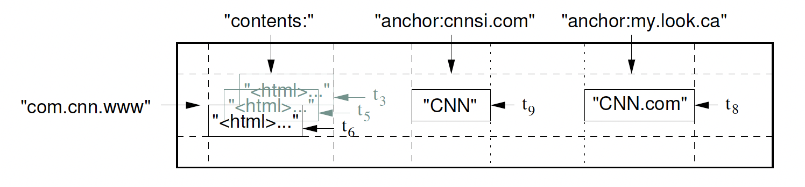
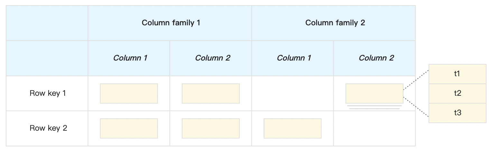
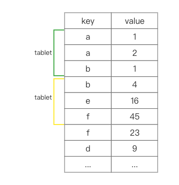
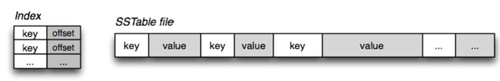
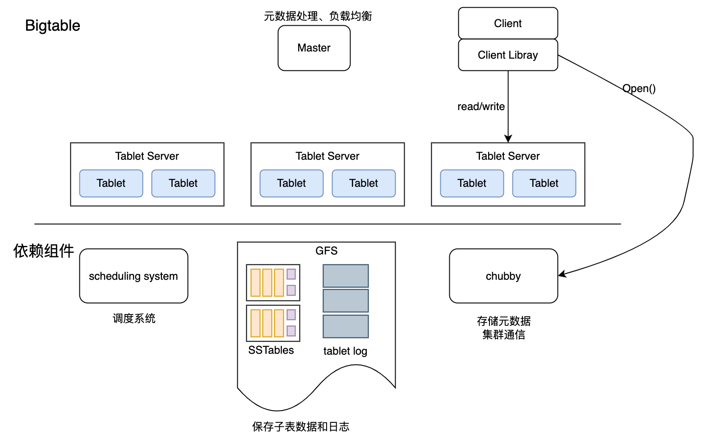
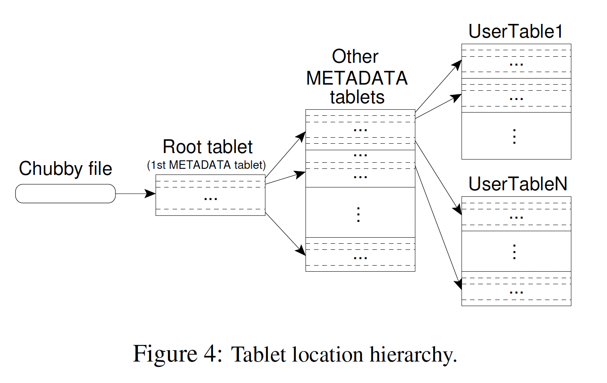
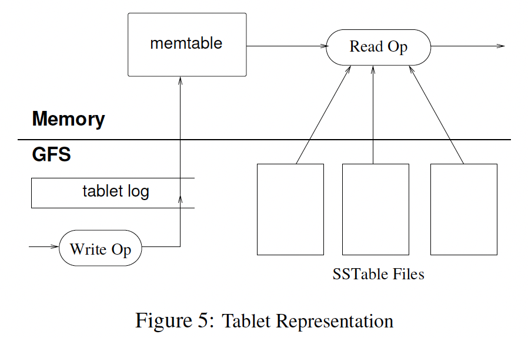

# 1. 简介

​     Bigtable 是一种压缩的、高性能的、高可扩展性的，基于GFS的数据存储系统，用于存储大规模结构化数据，适用于云端计算。

# 2. 数据模型

Bigtable 是一个稀疏、分布式、持久化存储的多维有序映射。其逻辑上提供表的功能，但在物理结构上基于 Map 实现。



```plain
(row:string, column:string, time:int64)  --> string
```



**行键：**
       可以是任意字符串，最大容量为 64KB，但是在大多数场景下，字节数只有 10～100 Bytes 左右。Bigtable 按行排序，对行键的操作是原子的。

**列键与列族：**

列键一般表示一种数据类型，列键的集合称作列族。存储在同一 列族下的数据属于同一种类型，列族下的数据被压缩在一起保存。

​      列族是访问控制、磁盘和内存计算的基本单元。数据在被存储之前必须先确定列族，然后才能确定具体的列键，并且表中的列族不会过多，通常几百个，但 Column key 的个数并不进行限制，可以有无限多个。

**时间戳：**
       不同版本的数据以时间戳降序的方式进行存储，以至于时间戳最近的版本最先会读取到。

**Tablet**
在 Bigtable 中，行键相同的数据可以有非常多，为此 Bigtable 中表的行区间需要动态划分，每个行区间称为一个 Tablet（子表）。**Tablet 是 Bigtable 数据分布和负载均衡的基本单位**，子表大小可以不同，默认的最大为 200 MB。Tablet 是一个连续的 Row Key 区间，当 Tablet 的数据量增长到一定大小后可以自动分裂为两个 Tablet。同时 Bigtable 也支持多个连续的 Tablet 合并为一个大的 Tablet。



# 3. Bigtable构件

Bigtable是建立在其它的几个Google基础构件上的。

1. 使用Google的分布式文件系统(GFS)存储日志文件和数据文件。
2. BigTable集群通常运行在一个共享的服务器集群中，依赖集群管理系统来实现作业调度，管理共享机器上的资源，处理机器故障以及监视机器状态。
3. Bigtable内部存储数据的文件是Google SSTable格式。`SSTable`提供了从`keys`到`values`的持久化的，顺序的，不可变的映射，它的keys和values均是任意字节数组；另外，`**SSTable**`提供了根据key检索value以及根据key范围检索Value的功能。

SSTable由很多`Block`（每个Block默认大小为64KB，可配置的）组成，`Block Index`（存储在Block尾部）用来定位Blocks，当客户端打开`**SSTable**`时，会将`Block Index`加载到内存的。

从`**SSTable**`中检索指定`key`的`values`时，首先加载`Block Index`到内存中，然后通过二分检索到`key`所在的Block，最后将磁盘中合适的`Block`加载到内存检索即可。



1. **Bigtable 依赖于 Chubby 提供的锁服务：**
   1. 保证集群内同时最多存在一个Master节点
   2. 存储 Bigtable 中表数据的启动位置；
   3. 发现Tablet服务以及检测Tablet是否存活。
   4. 存储 Bigtable 的列族信息;
   5. 存储访问控制列表；

**注意**：如果集群内的 Chubby 在长时间内不可用（比如宕机或者网络问题），那么整个 Bigtable 系统也将会不可用。但是如果系统内仅仅是部分 Chubby 不可用，那么事实上只会导致 Bigtable 的部分数据不可用。

# 4. Bigtable架构



## **客户端程序库**

客户端使用客户端程序库访问 Bigtable，客户端库会缓存子表的位置信息。当客户端访问 Bigtable 时，首先要调用程序库中的 `Open()` 函数获取文件目录，文件目录可能在缓存中，也可能通过与主服务器进行通信得到，最后再与子表服务器通信。

## 主服务器

1. 分配Tablet到哪个Tablet Server上；
2. 检测是否有Tablet Server新增或到期；
3. 进行子表服务器的负载均衡
4. 保存在 GFS 上的文件进行垃圾收集。
5. 主服务器持有活跃的子表服务器信息、子表的分配信息和未分配子表的信息。如果子表未分配，主服务器会将该子表分配给空间足够的子表服务器。

### **子表服务器**

1. 每个Tablet Server维护一个Tablet集合（每个Tablet Server通常可以维护10到1000个Tablet）；
2. 处理其负责的Tablet的读写请求，在Tablet太大时，负责Tablet的分裂；
3. 根据集群负载情况，Tablet Server可以动态添加或移除。

与其他单Master分布式存储系统类似，客户端数据不会路由到Master，而是直接与Tablet Server通信，进而实现数据的读写。

很多BigTable客户端不需要依赖于Master定位Tablet信息，所以大部分场景下客户端不需要与Master通信。

## 子表位置

Bigtable 使用三层类 B+ 树结构来存储元数据信息。

1. 第一层是存储在 Chubby 中， 它包含了Root Tablet的位置信息，一旦Chubby服务不可用，整个BigTable就丢失了*root tablet*的位置，整个服务也就不可用了
2. 第二层root table存储了了所有元数据子表的位置信息，为了保证整个树的深度不变，*root tablet*从不分裂。
3. 第三层元数据子表包含一组用户子表的位置信息。

在METADATA中存放的数据是key，value的形式。key:Tablet所在的表的标识符和Tablet 的最后一行编码而成的，value：该tablet存放的位置信息

在元数据的三级结构中，根子表不会被分割，用于确保子表的层次结构不超过三层。由于元数据行大约存储 1KB 的内存数据，在容量限制为 128MB 内的元数据子表中，三层模型可以标识 128MB/1KB * 128/1KB=2^32个子表。



当客户程序没有缓存Tablet的位置信息，或者缓存的地址信息不正确，那么客户程序会递归查询Tablet的位置信息，会进行三次网络寻址（chubby file、root tablet、METADATA tablets）。为了减少访问的开销，每次从METADATA中多读取几个Tablet的元数据。

## **tablet分配**

一个Tablet只能分配给一个Tablet服务器。Master服务器记录了当前有哪些活跃的Tablet服务器、哪些Tablet分配给了哪些Tablet服务器、哪些Tablet还没有被分配。当一个Tablet还没有被分配、并且刚好有一个Tablet服务器有足够的空闲空间装载该Tablet时，Master服务器会给这个Tablet服务器发送一个装载请求，把Tablet分配给这个服务器。

Bigtable使用Chubby跟踪记录Tablet服务器的状态。当一个Tablet服务器启动时，它在Chubby的一个指定目录下建立一个唯一的文件，并且获取该文件的独占锁。Master服务器实时监控着这个目录（服务器目录），因此Master服务器能够知道有新的Tablet服务器加入了。

**Tablet server故障**

如果文件不存在或tablet服务器丢失了该文件的独占锁，那么就认为该tablet服务器不能再提供服务。

Master服务器就删除该Tablet服务器在Chubby上的服务器文件以确保它不再提供服务。Master服务器就把之前分配给它的所有的Tablet放入未分配的Tablet集合中。

**master故障**

1. Master服务器从Chubby获取一个唯一的Master锁   --》保证只有一个master
2. Master服务器扫描Chubby的服务器文件锁存储目录，获取当前正在运行的服务器列表；
3. Master服务器和所有的正在运行的Tablet服务器通信，获取每个Tablet服务器上Tablet的分配信息；
4. Master服务器扫描METADATA表获取所有的Tablet的集合。在扫描的过程中，当Master服务器发现了一个还没有分配的Tablet，Master服务器就将这个Tablet加入未分配的Tablet集合并等待合适的时机分配。

**tablet集合变动的情况**

1. 建立新表、删除旧表、合并两个Tablet   -> 由master触发
2. Tablet被分割成两个小的Tablet               -> 由tablet服务器触发，并将结果同步到master

## Tablet服务



**写操作**

1. 先检查操作格式是否正确、验证权限
2. 更新操作提交到REDO日志中并落盘
3. 将写入的数据插到MemTable(排序的缓存表)
4. 当MemTable达到一定大小，将其冻结已SSTable的格式写入磁盘。同时创建一个MemTable用于写入新数据。

**读操作**

1. 数据检查、权限检验
2. 找到读取数据的tablet位置索引
3. 读取tablet所有的SSTable和memtable

Tablet的持久化状态信息保存在GFS上，更新操作提交到REDO日志中。在这些更新操作中，最近提交的数据存放在一个排序的缓存中，这个缓存称为MemTable；当达到一定大小后已SSTable的格式写入磁盘中。为了恢复一个Tablet，Tablet服务器首先从METADATA表中读取它的元数据。Tablet的元数据包含了组成这个Tablet的SSTable的列表，以及一系列的Redo Point，这些Redo Point指向可能含有该Tablet数据的已提交的日志记录。Tablet服务器把SSTable的索引读进内存，之后通过重复Redo Point之后提交的更新来重建MemTable。

##  **Compactions(空间压缩)**

**Minor Compaction（小合并）**   ->  内存中的MemTable转储到GFS中

随着写操作的执行，MemTable的大小不断增加。当MemTable的大小到达一个阈值的时候，这个MemTable就会被冻结，然后创建一个新的MemTable；被冻结住MemTable会被转换成SSTable，然后写入GFS。

Minor Compaction过程有两个目的：减少Tablet服务器使用的内存，以及在服务器灾难恢复过程中，减少必须从提交日志里读取的数据量。

在Compaction过程中，正在进行的读写操作仍能继续。(注：Bigtable中包含三种Compaction策略：Minor Compaction、Merging Compaction和Major Compaction。其中，Minor Compaction把内存中的MemTable转储到GFS中，Merging Compaction和Major  Compaction合并GFS中的多个SSTable文件生成一个更大的SSTable。Minor  Compaction主要是为了防止内存占用过多，Merging和Major Compaction则是为了防止读取文件个数过多。)

**Merging** **Compaction**

每一次Minor Compaction都会创建一个新的SSTable。如果Minor Compaction过程不停滞的持续进行下去，读操作可能需要合并来自多个SSTable的更新；我们通过定期在后台执行Merging Compaction过程合并文件，限制这类文件的数量。Merging Compaction过程读取一些SSTable和MemTable的内容，合并成一个新的SSTable。只要Merging Compaction过程完成了，输入的这些SSTable和MemTable就可以删除了。

**Major** **Compaction  --> 合并所有的SSTable和内存中的memtable**

合并所有的SSTable并生成一个新的SSTable的合并压缩过程叫作Major Compaction。由非Major Compaction产生的SSTable可能含有特殊的删除条目，这些删除条目能够隐藏在旧的、但是依然有效的SSTable中。而Major Compaction过程生成的SSTable不包含已经删除的信息或数据。Bigtable循环扫描它所有的Tablet，并且定期对它们执行Major Compaction。Major Compaction机制允许Bigtable回收已删除数据所占用的资源，并且确保Bigtable能及时清除已经删除的数据

# 5、优化

### Locality Groups

客户端可以将多个列族组成`Locality Graph`。每个Tablet会为Locality Group中的数据单独生成SSTable。

将通常不会一切访问的列族分离到单独的`Locality Group`中，可以实现更高效的数据读取。

**压缩 (Compression)**

客户端可以控制是否压缩`Locality Group`的SSTables以及使用哪种方式进行压缩。

用户指定的压缩格式应用于每个SSTable Block（其大小可通过特定于局部性组的调整参数进行控制）。

通过单独压缩每个块会损失一些空间，但好处是可以读取SSTable的小部分，而无需对整个文件进行解压缩。

### Caching(缓存)

为了提升数据读取性能，Tablet Server使用两级缓存。

`**Scan Cache**`是Higher-Level缓存，该缓存会缓存SSTablet接口返回的Key-Value键值对。

`**Block Cache**`是Lower-Level缓存，该缓存会缓存从GFS中读取的SSTable Block。

`**Scan Cache**`对于需要频繁访问相同数据的应用程序来说是非常有用的。

`**Block Cache**`则对需要访问临近数据的应用程序来说非常有用。

**Bloom过滤器**

一个读操作必须读取构成Tablet状态的所有SSTable的数据。如果这些SSTable不在内存中，那么就需要多次访问硬盘。通过查询一个SSTable是否包含了特定行和列的数据来减少硬盘访问的次数。

**Commit日志的实现**

如果对每个Tablet的操作的Commit日志都存在一个单独的文件，那么会产生大量的文件，并行写入GFS时，会有磁盘的寻道。

为了解决这个问题，对每个Tablet服务器设置了一个Commit日志文件，把修改操作的日志以追加方式写入同一个日志文件，因此一个实际的日志文件中混合了对多个Tablet修改的日志记录，这样显著提高了写入性能，但是在tablet宕机的情况下恢复变得复杂。

解决方法：为了避免多次读取日志文件，我们首先把日志按照关键字（table，row name，log sequence number）排序。排序之后，对同一个Tablet的修改操作的日志记录就连续存放在了一起，因此，我们只要一次磁盘Seek操作，之后顺序读取就可以了

**Tablet恢复提速**

当Master服务器将一个Tablet从一个Tablet服务器转移到另外一个Tablet服务器时，源Tablet服务器会对这个Tablet做一次Minor Compaction。这个Compaction操作减少了Tablet服务器的日志文件中没有归并的记录，从而减少了恢复的时间。Compaction完成之后，该服务器就停止为该Tablet提供服务。在卸载Tablet之前，源Tablet服务器还会再做一次（通常会很快）Minor Compaction，以消除前面在一次压缩过程中又产生的未归并的记录。第二次Minor Compaction完成以后，Tablet就可以被装载到新的Tablet服务器上了，并且不需要从日志中进行恢复。